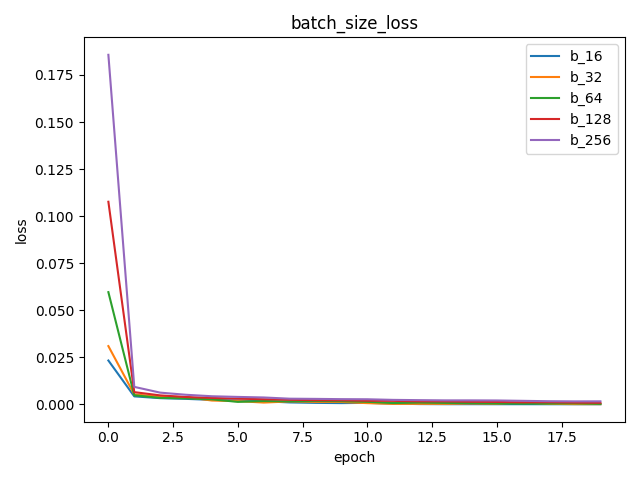
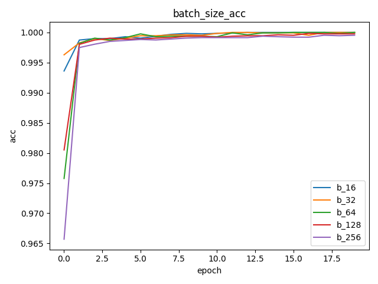
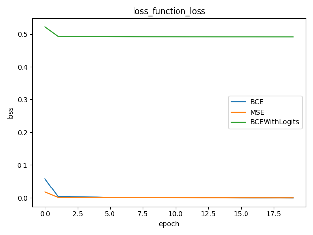
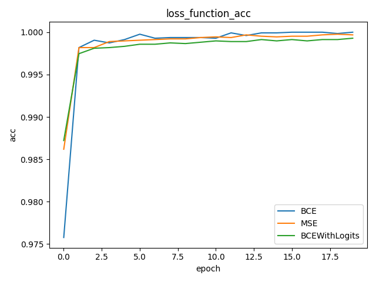
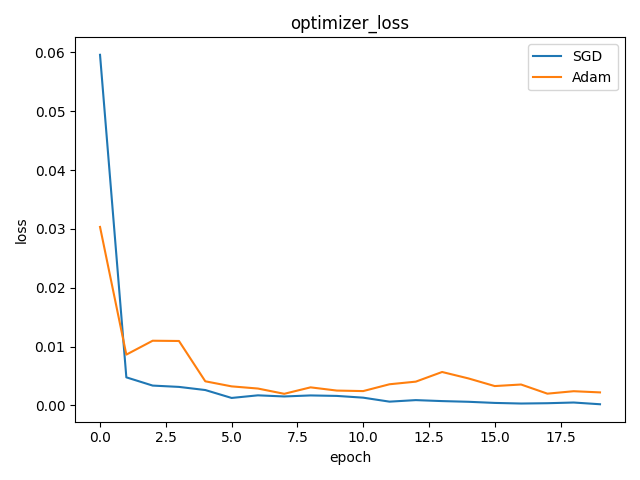
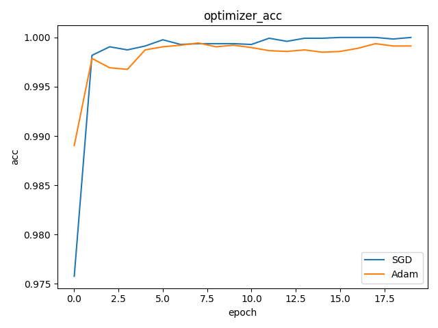

# MNIST
<br>
### Overview 
Simple pytorch implementation of MNIST dataset classification<br>
目录结构：<br>

### Code structure
* [`mnist`](mnist)： mnist数据集存放文件夹
* [`activate_function`](activate_function)：不同的activate_function下的实验结果存放文件夹
	* `activate_function_loss.png`
	* `activate_function_acc.png`
	* `activate_function_time.png`
	* ...
* [`loss_function`](loss_function)：不同的loss_function下的实验结果存放文件夹
	* `loss_function_loss.png`
	* `loss_function_acc.png`
	* `loss_function_time.png`
	* ...
* [`optimizer`](optimizer)：不同的optimizer下的实验结果存放文件夹
	* `optimizer_loss.png`
	* `optimizer_acc.png`
	* `optimizer_time.png`
	* ...
* [`batch_size`](batch_size)：不同的batch_size下的实验结果存放文件夹
	* `batch_size_loss.png`
	* `batch_size_acc.png`
	* `batch_size_time.png`
	* ...
* [`batch_size.py`](batch_size.py)：对batch_size文件夹下的实验结果进行可视化
* [`activate_function.py`](activate_function.py)：对activate_function文件夹下的实验结果进行可视化
* [`loss_function.py`](loss_function.py)：对loss_function文件夹下的实验结果进行可视化
* [`optimizer.py`](optimizer.py)：对optimizer文件夹下的实验结果进行可视化
* [`model.py`](model.py)：定义模型结构
* [`test.py`](test.py)：测试代码
* [`train.py`](train.py)：训练代码
* [`README.md`](README.md)：实验报告
### Dependencies
```
python 3.8.0
```
```
pytorch 1.6.0
```
```
numpy
```
```
matplotlib
```

### Usage
1. 加载数据
```
python dataloader.py
```
2. 训练模型
```
python train.py
```
3. 测试模型
```
python test.py
```
4. 画出不同batch_size下的训练损失和准确率曲线
```
python batch_size.py
```
5. 画出不同activate_funtion下的训练损失和准确率曲线
```
python activate_funtion.py
```
6. 画出不同loss_function下的训练损失和准确率曲线
```
python loss_function.py
```
7. 画出不同optimizer下的训练损失和准确率曲线
```
python optimizer.py
```
<br>

### Results
#### Batch_size
训练过程中batch size分别取16，32，64，128，256时的损失和准确率变化曲线(其他参数：activate function使用ReLU，loss function使用BCELoss，optimizer使用SGD)<br>
<br>
<br>
1) batch数太小，而类别又比较多的时候，可能导致loss的函数震荡而不收敛，尤其是网络比较复杂的时候。<br>
2）随着batchsize增大，处理相同的数据量的速度越快。<br>
3）随着batchsize增大，达到相同精度所需要的epoch数量越多。<br>
4）由于上述两种因素的矛盾，Batch Size增大到某个程度，达到时间上的最优。<br>
5）由于最终收敛精度会陷入不同的局部极值，因此Batch Size增大到某个时候，达到最终收敛精度上的最优。<br>
6）过大的batch size的结果是网络很容易收敛到一些不好的局部最优点。同样太小的batch size也存在一些问题，比如训练速度很慢，训练不容易收敛。<br>
7) 具体的batchsize的选取和训练集的样本数目相关。<br>
#### Activate_function
训练过程中activate function分别取ReLU、Sigmoid、Tanh时的损失和准确率变化曲线(其他参数：batch size使用64，loss function使用BCELoss，optimizer使用SGD)<br>
<br>
<br>
1）sigmoid函数的输出映射在（0,1）之间，单调连续，输出范围有限，优化稳定。求导容易。幂运算，计算成本高。导数值小于1，容易出现梯度消失。具体来说就是当x很小或很大时，存在导数很小的情况。另外，神经网络主要的训练方法是BP算法，BP算法的基础是导数的链式法则，也就是多个导数的乘积。而sigmoid的导数最大为0.25，多个小于等于0.25的数值相乘，其运算结果很小。随着神经网络层数的加深，梯度后向传播到浅层网络时，基本无法引起参数的扰动，也就是没有将loss的信息传递到浅层网络，这样网络就无法训练学习了。这就是所谓的梯度消失。Sigmoid 函数的输出不是以零为中心的，这会导致神经网络收敛较慢。<br>
2)双曲正切函数，tanh函数输出以0为中心，区间为[−1,1]，tanh可以想象成两个sigmoid函数放在一起，性能要高于sigmoid函数。Tanh函数是 0 均值的，因此实际应用中 Tanh 会比 sigmoid 更好。但是仍然存在梯度饱和与exp计算的问题。<br>
3)线性整流函数，又称修正线性单元，是一种人工神经网络中常用的激活函数，通常指代以斜坡函数及其变种为代表的非线性函数。<br>
优点：<br>
[1] 可以使网络训练更快。相比于sigmoid、tanh，导数更加好求，反向传播就是不断的更新参数的过程，因为其导数不复杂形式简单。<br>
[2] 增加网络的非线性。本身为非线性函数，加入到神经网络中可以是网格拟合非线性映射。<br>
[3] 防止梯度消失。当数值过大或者过小，sigmoid，tanh的导数接近于0，relu为非饱和激活函数不存在这种现象。<br>
[4] 使网格具有稀疏性。<br>
缺点：<br>
[1]ReLU的输出不是0均值的。<br>
[2]Dead ReLU Problem(神经元坏死现象)<br>
#### Loss_function
训练过程中loss function分别取BCE、MSE、BCEWithLogits时的损失和准确率变化曲线(其他参数：batch size使用64，activate function使用ReLU，optimizer使用SGD)<br>
<br>
<br>
1）均方误差（Mean Square Error,MSE）是回归损失函数中最常用的误差，它是预测值f(x)与目标值y之间差值平方和的均值。<br>
优点：MSE的函数曲线光滑、连续，处处可导，便于使用梯度下降算法，是一种常用的损失函数。 而且，随着误差的减小，梯度也在减小，这有利于收敛，即使使用固定的学习速率，也能较快的收敛到最小值。<br>
缺点：当真实值y和预测值f(x)的差值大于1时，会放大误差；而当差值小于1时，则会缩小误差，这是平方运算决定的。MSE对于较大的误差(>1)给予较大的惩罚，较小的误差(<1）给予较小的惩罚。也就是说，对离群点比较敏感，受其影响较大。<br>
2)BCELoss，二分类任务时的交叉熵计算函数。此函数可以认为是nn.CrossEntropyLoss函数的特例。其分类限定为二分类，y必须是{0,1}。还需要注意的是，input应该为概率分布的形式，这样才符合交叉熵的应用。所以在BCELoss之前，input一般为sigmoid激活层的输出<br>
3)BCEWithLogitsLoss，损失函数把二分类任务时的交叉熵计算函数。BCEWithLogitsLoss损失函数把 Sigmoid 层集成到了 BCELoss类中。该版比用一个简单的 Sigmoid 层和 BCELoss 在数值上更稳定，因为把这两个操作合并为一个层之后, 可以利用 log-sum-exp 的技巧来实现数值稳定。

#### Optimizer
训练过程中optimizer分别取SGD，Adam时的损失和准确率变化曲线(其他参数：batch size使用64，activate function使用ReLU，loss_function使用BCELoss)<br>
<br>
<br>
1)SGD(Stochastic gradient descent)，梯度更新规则:和 BGD 的一次用所有数据计算梯度相比，SGD 每次更新时对每个样本进行梯度更新，对于很大的数据集来说，可能会有相似的样本，这样 BGD 在计算梯度时会出现冗余，而 SGD 一次只进行一次更新，就没有冗余，而且比较快，并且可以新增样本。<br>缺点:<br>
但是 SGD 因为更新比较频繁，会造成 cost function 有严重的震荡。BGD 可以收敛到局部极小值，当然 SGD 的震荡可能会跳到更好的局部极小值处。
当我们稍微减小 learning rate，SGD 和 BGD 的收敛性是一样的。<br>
2)Adam这个算法是另一种计算每个参数的自适应学习率的方法。除了像 Adadelta 和 RMSprop 一样存储了过去梯度的平方 vt 的指数衰减平均值 ，也像 momentum 一样保持了过去梯度 mt 的指数衰减平均值：如果 mt 和 vt 被初始化为 0 向量，那它们就会向 0 偏置，所以做了偏差校正，通过计算偏差校正后的 mt 和 vt 来抵消这些偏差。


### References
1. [MNIST dataset url]
2. [https://github.com/hamlinzheng/mnist]

[MNIST dataset url]: http://yann.lecun.com/exdb/mnist/
[https://github.com/hamlinzheng/mnist]: https://github.com/hamlinzheng/mnist

